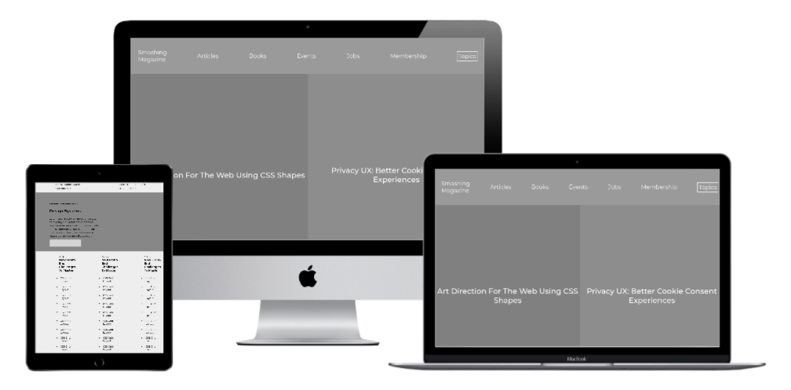

<h1 align="center">Design-Teardown App 👋</h1>

  
  

> This is an attempt to clone [Smashing Magazine](http://smashingmagazine.com) as part of completing the curriculum at [Microverse](https://microverse.org)

# Built With

- HTML5
- CSS3

### ✨ Demo

[Demo](https://rawcdn.githack.com/sabayounis/Design-Teardown/dc76983cdab8e255a2dfd5d1bee1cb85485ceeac/index.html)

## Authors

- [Abubakar Diallo](https://github.com/abruzy)
- [Saba Younis](https://github.com/sabayounis)

👤 **Abubakar Diallo**

* Twitter: [@abruzy01](https://twitter.com/abruzy01)
* Github: [@abruzy](https://github.com/abruzy)
* LinkedIn: [@abubakardiallo](https://linkedin.com/in/abubakardiallo)

👤 **Saba Younis**

* Github: [@abruzy](https://github.com/sabayounis)

## 🤝 Contributing

Contributions, issues and feature requests are welcome!

Feel free to check the [issues page](https://github.com/abruzy/react-meal-catalogue/issues).

## Show your support

Give a ⭐️ if you like this project!

## Acknowledgments

- [Microverse](https://www.microverse.org/)

## 📝 License

This project is [MIT](lic.url) licensed.
